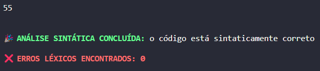

# Compilador utilizando Flex e Bison

Desenvolvido durante a disciplina de compiladores no período 2022/1 da Universidade Tecnológica Federal do Paraná - Câmpus Pato Branco.

O compilador em questão se baseia na linguagem Small L apresentada em sala de aula.

## Partes do compilador presentes no projeto

- Analisador léxico com Flex;
- Analisador sintático com Bison;
- Análise semântica de expressões com números inteiros com Bison

## Desenvolvedores

- [Daniel Gustavo Favero](https://github.com/danielg-favero)

## Configuração inicial

Para compilar seus programas é necessário ter instalado em sua máquina as ferramentas `flex` e `bison`. Além de um compilador para a linguagem C, para este projeto estou utilizando o `gcc`.

## Como iniciar o projeto

1. Clone o repositório

```bash
git clone https://github.com/danielg-favero/compiladores
```

2. Abra a pasta clonada

```bash
cd compiladores
```

3. Escreva um programa em um arquivo teste, o exemplo abaixo tem o nome de `input.s` e está na raiz do projeto

```c
programa teste1 ;
var
    x , y : inteiro ;
inicio
    x := 5 ;
    y := 10 ;
    x := x + x * y ;
    escreva ( x )
fim
```

4. Compile o programa, o script de compilação se encontra em `scripts/run.sh`

```bash
./scripts/run.sh input.s
```

5. A saída do programa deverá ser como segue

